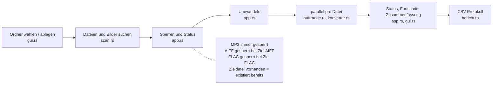

# Ablauf

```mermaid
flowchart LR
    A["Ordner wählen / ablegen<br/>gui.rs"] --> B["Dateien und Bilder suchen<br/>scan.rs"]
    B --> C["Sperren und Status<br/>app.rs"]
    C --> D["Umwandeln<br/>app.rs"]
    D --> E["parallel pro Datei<br/>auftraege.rs, konverter.rs"]
    E --> F["Status, Fortschritt, Zusammenfassung<br/>app.rs, gui.rs"]
    F --> G["CSV-Protokoll<br/>bericht.rs"]
    C -.- N["MP3 immer gesperrt<br/>AIFF gesperrt bei Ziel AIFF<br/>FLAC gesperrt bei Ziel FLAC<br/>Zieldatei vorhanden = existiert bereits"]
```
