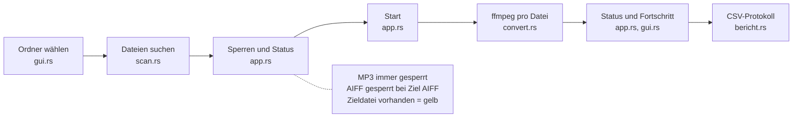

# Ablauf

```mermaid
flowchart LR
    A["Ordner wählen<br/>gui.rs"] --> B["Dateien suchen<br/>scan.rs"]
    B --> C["Sperren und Status<br/>app.rs"]
    C --> D["Start<br/>app.rs"]
    D --> E["ffmpeg pro Datei<br/>convert.rs"]
    E --> F["Status und Fortschritt<br/>app.rs, gui.rs"]
    F --> G["CSV-Protokoll<br/>bericht.rs"]
    C -.- N["MP3 immer gesperrt<br/>AIFF gesperrt bei Ziel AIFF<br/>Zieldatei vorhanden = gelb"]
```
