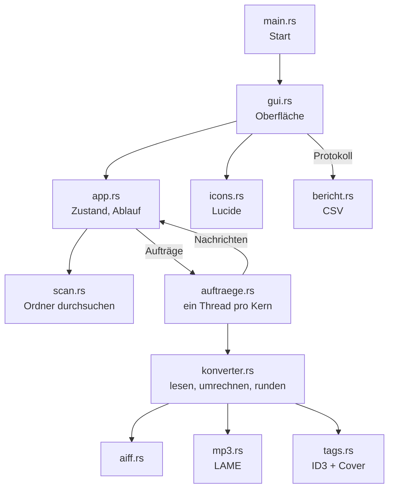

# Architektur

```mermaid
flowchart TD
    main["main.rs<br/>Start"] --> gui["gui.rs<br/>Oberfläche"]
    gui --> app["app.rs<br/>Zustand, Ablauf"]
    gui --> icons["icons.rs<br/>Lucide"]
    gui -->|Protokoll| bericht["bericht.rs<br/>CSV"]
    app --> scan["scan.rs<br/>Ordner durchsuchen"]
    app -->|Aufträge| auftraege["auftraege.rs<br/>ein Thread pro Kern"]
    auftraege -->|Nachrichten| app
    auftraege --> konverter["konverter.rs<br/>lesen, umrechnen, runden"]
    konverter --> aiff["aiff.rs"]
    konverter --> mp3["mp3.rs<br/>LAME"]
    konverter --> tags["tags.rs<br/>ID3 + Cover"]
```
