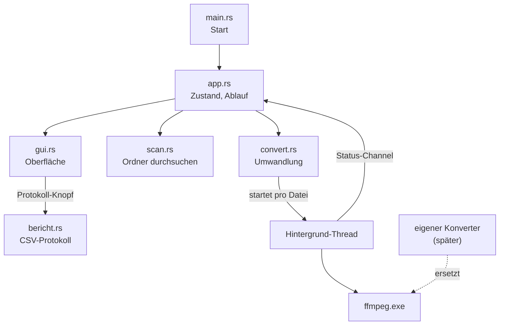

# Architektur

```mermaid
flowchart TD
    main["main.rs<br/>Start"] --> app["app.rs<br/>Zustand, Ablauf"]
    app --> gui["gui.rs<br/>Oberfläche"]
    app --> scan["scan.rs<br/>Ordner durchsuchen"]
    app --> convert["convert.rs<br/>Umwandlung"]
    gui -->|Protokoll-Knopf| bericht["bericht.rs<br/>CSV-Protokoll"]
    convert -->|startet pro Datei| thread["Hintergrund-Thread"]
    thread -->|Status-Channel| app
    thread --> ffmpeg["ffmpeg.exe"]
    konverter["eigener Konverter<br/>(später)"] -.->|ersetzt| ffmpeg
```
