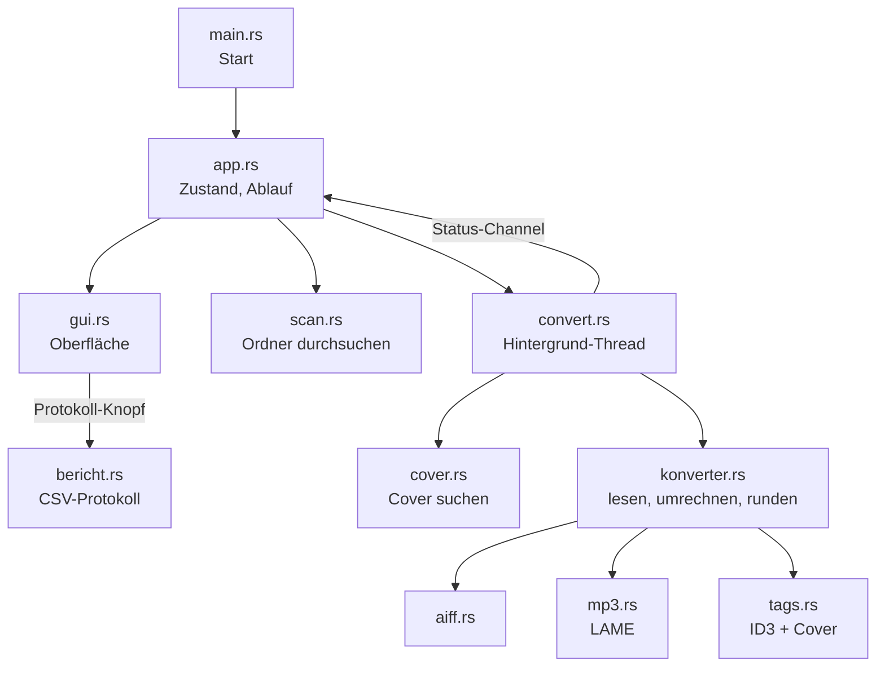

# Architektur

```mermaid
flowchart TD
    main["main.rs<br/>Start"] --> app["app.rs<br/>Zustand, Ablauf"]
    app --> gui["gui.rs<br/>Oberfläche"]
    app --> scan["scan.rs<br/>Ordner durchsuchen"]
    app --> convert["convert.rs<br/>Hintergrund-Thread"]
    gui -->|Protokoll-Knopf| bericht["bericht.rs<br/>CSV-Protokoll"]
    convert --> cover["cover.rs<br/>Cover suchen"]
    convert --> konverter["konverter.rs<br/>lesen, umrechnen, runden"]
    konverter --> aiff["aiff.rs"]
    konverter --> mp3["mp3.rs<br/>LAME"]
    konverter --> tags["tags.rs<br/>ID3 + Cover"]
    convert -->|Status-Channel| app
```
